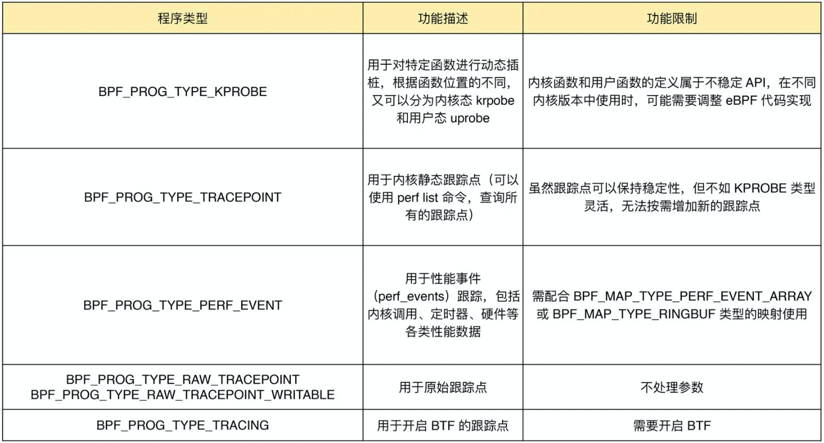

1. 查询当前系统支持的程序类型  
`bpftool feature probe | grep program_type`
2. bpf_prog_type
   `linux/bpf.h 中 bpf_prog_type 的定义`
3. 
4. 查询所以内核跟踪点  
  `perf list`
5. 判断系统是否启用了cgroups v2
    `cat /sys/fs/cgroup/cgroup.controllers `
    `https://blog.csdn.net/kiritow/article/details/118079768`
6. 怎么查询内核跟踪点
```azure
    内核把所有函数以及非栈变量的地址 "/proc/kallsyms"
    sudo ls /sys/kernel/debug  来查询内核调试文件系统的具体信息（不存在重新挂载，sudo mount -t debugfs debugfs /sys/kernel/debug）
    如查询  execve  系统调用的参数格式：
    sudo cat /sys/kernel/debug/tracing/events/syscalls/sys_enter_execve/format
    性能事件 sudo perf list [hw|sw|cache|tracepoint|pmu|sdt|metric|metricgroup]

```
```azure
    # 查询所有内核插桩和跟踪点sudo bpftrace -l
    # 使用通配符查询所有的系统调用跟踪点sudo bpftrace -l 'tracepoint:syscalls:*'
    # 使用通配符查询所有名字包含"execve"的跟踪点sudo bpftrace -l '*execve*'
    # 查询execve入口参数格式
    $ sudo bpftrace -lv tracepoint:syscalls:sys_enter_execve
    tracepoint:syscalls:sys_enter_execve
        int __syscall_nr
        const char * filename
        const char *const * argv
        const char *const * envp
    
    # 查询execve返回值格式
    $ sudo bpftrace -lv tracepoint:syscalls:sys_exit_execve
    tracepoint:syscalls:sys_exit_execve
        int __syscall_nr
        long ret
```